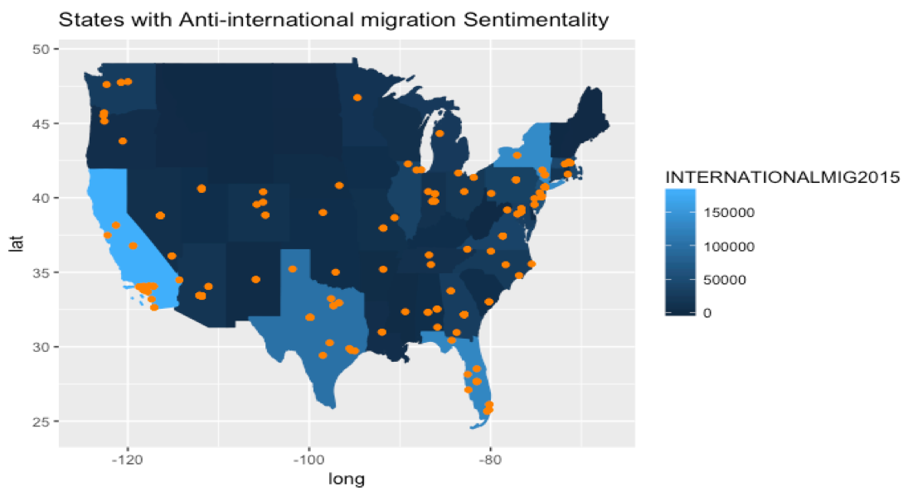
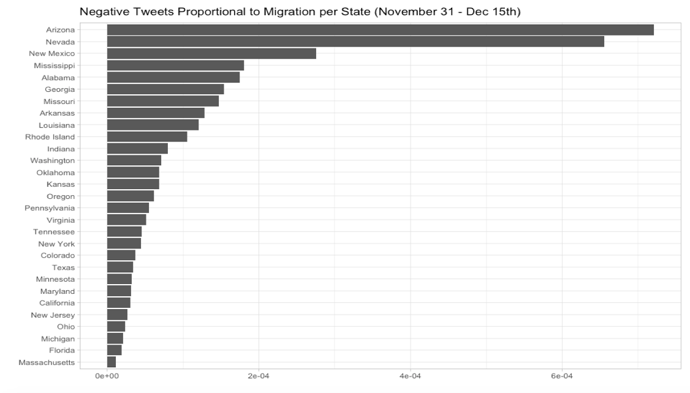

---
output: 
  html_document: 
    keep_md: yes
---

* Name: Bianca Gonzalez

* Project title: Tweets and International Migration in the USA

* Write-up on RPubs: <http://rpubs.com/biancaglez94/FinalTwitterProject>

Abstract: 

This paper describes the goals, methodologies, results, and limitations accompanying research using a website scraped dataset from Twitter. This research is intended to lay groundwork as to where population geography can begin to use other forms of irregular datasets to extend its scope. The research encompasses several areas of study to inform the methodology and discussion. The question asked is: does an increase in migration have an effect on negative sentiments? To answer this, an analysis of a small 2016 Twitter dataset of users’ anti-international migration sentiments was analyzed alongside an international migration flows dataset (Census) The regression models show that for every unit increase of international migration there is a miniscule increase of hate tweets. However, in an exploratory data analysis, the states with the lowest migration inflows also have the highest rate of anti international migration tweets. The results of the methodology are mixed, and show there is room for expansion, especially in collecting a rich dataset, over months of scraping, with coordinates of true location. The paper hopes to eventually inform others in their use non-formal datasets to determine global flow phenomena.  

Motivation:

The anti-immigration sentiments expressed by many in the United States and our President Elect, inspired an urgency in uncovering the forces behind the national divide. To begin to parse away at this, the research question attempts to find the relationship between international migration change and negative sentiments about migration tweeted within the continental United States. Specifically, the research question attempts to understand how a change in migration in an area can change the general sentiments towards migration. One of many hypothesis for a divide in the country is: many people expressing discontent with migrants are generally unexposed to migrants themselves.

 
